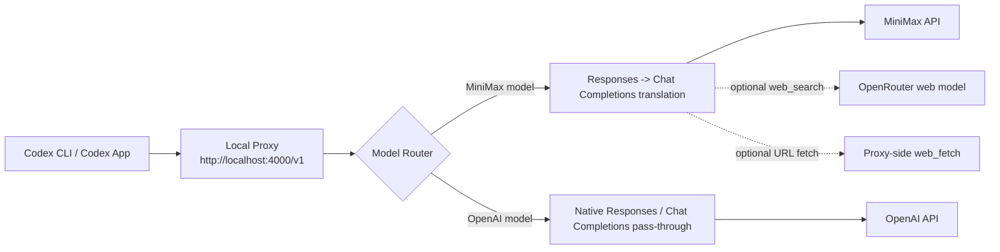

<div align="center">

# codex-minimax-proxy

### One local Codex endpoint for MiniMax translation, OpenAI pass-through, and cleaner tool routing

[](https://nodejs.org/)
[](./LICENSE)
[](#architecture)
[](https://platform.minimax.io)
[](https://platform.openai.com/)
[](https://openrouter.ai/)

[Overview](#overview) • [Quick Start](#quick-start) • [Config](#configuration) • [Routing](#routing-rules) • [Launchers](#desktop-launchers) • [Endpoints](#endpoints)

</div>

## Overview

`codex-minimax-proxy` is a lightweight local proxy for Codex CLI and Codex App. It lets you keep one local `base_url` while routing each request by model:

- MiniMax models are translated from OpenAI-style Responses API requests into MiniMax Chat Completions.
- OpenAI models are forwarded natively to OpenAI Responses or Chat Completions.
- URL-heavy MiniMax runs can use a proxy-side `web_fetch` tool instead of getting stuck trying shell HTTP tools.

This is useful when you want MiniMax available inside Codex without giving up normal GPT-family workflows.

## Architecture



## Recent Updates

Recent commits shifted this repo from a single-model translator into a multi-provider router with stronger tool handling:

| Commit | Update |
|---|---|
| `a9bbc6d` | Switched the default OpenRouter search model to `nvidia/nemotron-3-super-120b-a12b:free` |
| `f111abc` | Previously switched the search model to `Qwen3 Coder`, then superseded |
| `8b55987` | Added `web_fetch` loop deduplication, stuck-loop detection, and GitHub auth injection |
| `d220cb8` | Added `/v1/chat/completions` and a tool-call loop circuit breaker |
| `74c0a0c` | Improved subagent compatibility by removing a tool-call limit and preserving more metadata/events |
| `70b489f` | Fixed consecutive assistant messages and truncated oversized tool outputs |
| `40806ab` | Fixed mid-action stalls and added `previous_response_id` support |

## What I Improved

I tightened the latest tool-routing work in `proxy.mjs`:

- `web_fetch` injection is now deduplicated instead of blindly appending another function tool definition.
- URL detection now uses the same logic in both the Responses and Chat Completions MiniMax paths.
- The proxy also avoids duplicating the `web_fetch` instruction message when it is already present.

That reduces noisy tool payloads and makes behavior more predictable in long or resumed conversations.

## Important Limitation

This proxy does not convert a ChatGPT subscription login into a generic localhost API.

If your goal is "keep using my normal Codex plan and also have MiniMax available," the clean setup is:

- keep native `codex login` as your default OpenAI path
- add a separate MiniMax profile that points at this proxy

## Features

- MiniMax Responses -> Chat Completions translation
- OpenAI Responses pass-through
- OpenAI Chat Completions pass-through
- Model-based provider routing
- Combined `/v1/models` model catalog
- Streaming support on both routing paths
- `previous_response_id` bridging for responses stored by the proxy
- MiniMax tool-call ordering repair
- Tool-call loop circuit breaker
- Proxy-side `web_fetch` for URL-heavy MiniMax turns
- Optional OpenRouter fallback for MiniMax `web_search`
- Zero runtime dependencies

## Quick Start

### 1. Clone and configure

```bash
git clone https://github.com/DevvGwardo/codex-minimax-proxy.git
cd codex-minimax-proxy
cp env.example .env
```

Set at least one upstream key:

```bash
export MINIMAX_API_KEY="..."
export OPENAI_API_KEY="..."
```

You can set one or both. If both are present, the proxy can route by model name.

### 2. Start the proxy

```bash
node proxy.mjs
```

The default listener is:

```text
http://localhost:4000/v1
```

### 3. Point Codex at it

Recommended if you already use native `codex login` for GPT models:

```toml
model = "gpt-5.4"

[profiles.minimax]
model = "MiniMax-M2.7"
model_provider = "minimax_proxy"

[model_providers.minimax_proxy]
name = "MiniMax Proxy"
base_url = "http://localhost:4000/v1"
env_key = "MINIMAX_API_KEY"
```

Use it like this:

```bash
codex
codex -p minimax
```

## Usage Modes

### Option A: Native Codex by default, MiniMax as a profile

This is the safest and simplest setup for most people.

- GPT-family requests keep using your normal Codex login path.
- MiniMax is available only when you opt into the profile.

### Option B: One proxy in front of both MiniMax and OpenAI API models

Use this only if you want all traffic routed through the proxy and you are comfortable using API-key-backed OpenAI access.

```toml
model = "gpt-5.4"
model_provider = "local_router"

[model_providers.local_router]
name = "Local Router"
base_url = "http://localhost:4000/v1"
env_key = "MINIMAX_API_KEY"
```

In this mode the proxy uses its own upstream environment variables:

- `MINIMAX_API_KEY` for MiniMax models
- `OPENAI_API_KEY` for OpenAI models

## Routing Rules

### Exact model routing

The proxy advertises and routes models from:

- `MINIMAX_MODELS`
- `OPENAI_MODELS`

Default values:

```text
MINIMAX_MODELS=MiniMax-M2.7
OPENAI_MODELS=gpt-5.4,gpt-5.4-mini,gpt-5.4-nano,gpt-4o
```

### Prefix routing

If a model is not explicitly listed, it can still route to OpenAI by prefix:

```text
OPENAI_MODEL_PREFIXES=gpt-,o1,o3,o4,codex-,chatgpt-
```

### Default provider fallback

If a request is missing a model or the model is ambiguous, fallback order is:

1. `DEFAULT_PROVIDER`, if set and enabled
2. OpenAI, if enabled
3. MiniMax, if enabled

## Configuration

| Variable | Default | Description |
|---|---|---|
| `PROXY_PORT` | `4000` | Local listen port |
| `DEFAULT_PROVIDER` | auto | Fallback provider when model is missing or ambiguous |
| `MINIMAX_API_KEY` | unset | Enables MiniMax routing |
| `MINIMAX_BASE_URL` | `https://api.minimax.io/v1` | MiniMax upstream base URL |
| `MINIMAX_MODELS` | `MiniMax-M2.7` | Models exposed as MiniMax |
| `OPENAI_API_KEY` | unset | Enables OpenAI routing |
| `OPENAI_BASE_URL` | `https://api.openai.com/v1` | OpenAI upstream base URL |
| `OPENAI_MODELS` | `gpt-5.4,gpt-5.4-mini,gpt-5.4-nano,gpt-4o` | Models exposed as OpenAI |
| `OPENAI_MODEL_PREFIXES` | `gpt-,o1,o3,o4,codex-,chatgpt-` | Prefix heuristics for OpenAI routing |
| `OPENROUTER_API_KEY` | unset | Optional search fallback for MiniMax `web_search` |
| `OPENROUTER_SEARCH_MODEL` | `nvidia/nemotron-3-super-120b-a12b:free` | OpenRouter search model |
| `GITHUB_TOKEN` | auto via `gh auth token` | Used for GitHub API fetches in `/cop` and `web_fetch` |

## Endpoints

| Method | Path | Description |
|---|---|---|
| `GET` | `/health` | Health summary, enabled providers, default provider |
| `GET` | `/v1/models` | Combined model list from enabled providers |
| `GET` | `/cop?url=...` | Quick URL fetch using Jina/raw HTTP |
| `POST` | `/cop` | URL fetch endpoint with method, headers, and body |
| `POST` | `/v1/responses` | Main Codex-compatible endpoint |
| `POST` | `/v1/chat/completions` | Direct Chat Completions endpoint |

## MiniMax-Specific Behavior

When a request routes to MiniMax, the proxy applies MiniMax-oriented normalization:

- `system` and `developer` roles are flattened to `user`
- tool results are reordered so they directly follow their tool calls
- `reasoning_split: true` is injected
- older oversized tool outputs are truncated
- long conversations are trimmed more aggressively
- direct URLs can trigger proxy-side `web_fetch`
- `web_search` can be rerouted to OpenRouter if configured

## Model Switching Notes

The proxy can bridge `previous_response_id` across providers only for responses it has already stored locally.

That means:

- MiniMax -> OpenAI works for stored proxy-managed chains
- OpenAI -> MiniMax works for stored proxy-managed chains
- native Codex/OpenAI outside the proxy -> MiniMax through the proxy is not reconstructable automatically

## Launcher Scripts

This repo includes helper scripts so users do not have to remember profile flags.

```bash
npm run codex:gpt
npm run codex:minimax
npm run codex:app:gpt
npm run codex:app:minimax
```

Notes:

- `codex:minimax` auto-starts the local proxy if needed
- the MiniMax launcher disables OpenRouter by default unless you opt in
- if you want MiniMax-side `web_search`, run:

```bash
CODEX_MINIMAX_USE_OPENROUTER=1 npm run codex:minimax
CODEX_MINIMAX_USE_OPENROUTER=1 npm run codex:app:minimax
```

## Desktop Launchers

For non-technical users, the easiest path is a desktop launcher that opens Codex in the chosen mode.

### macOS

```bash
npm run install:launchers:mac
```

Creates a `Codex Launchers` folder on the Desktop with:

- `Codex GPT.command`
- `Codex MiniMax.command`

### Windows

```powershell
powershell -NoLogo -NoProfile -ExecutionPolicy Bypass -File .\scripts\install-windows-launchers.ps1
```

Creates a Desktop folder with:

- `Codex GPT.lnk`
- `Codex MiniMax.lnk`
- matching `.cmd` and `.ps1` launchers

## Health Checks

```bash
curl http://localhost:4000/health
curl http://localhost:4000/v1/models
```

Example health response:

```json
{
  "status": "ok",
  "proxy": "codex-minimax-proxy",
  "providers": ["minimax", "openai"],
  "default_provider": "openai"
}
```

## Requirements

- Node.js 18+
- at least one upstream API key: MiniMax and/or OpenAI

## Links

- [MiniMax Platform](https://platform.minimax.io)
- [OpenAI Platform](https://platform.openai.com/)
- [OpenRouter](https://openrouter.ai/)
- [OpenAI Codex](https://github.com/openai/codex)

## License

MIT
